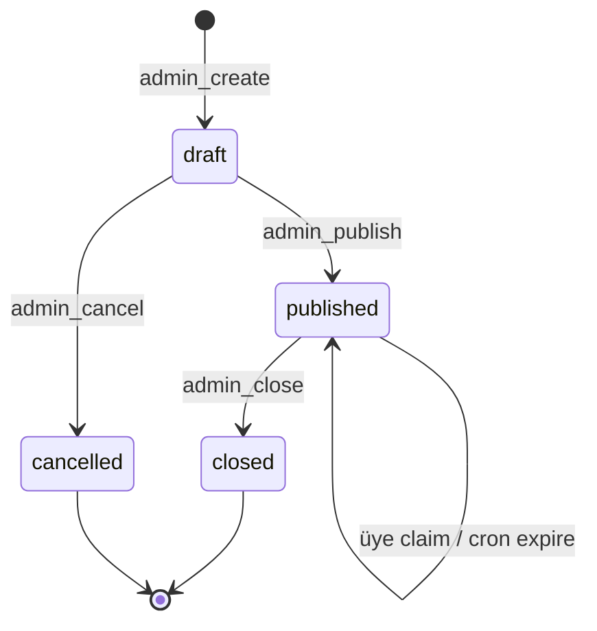

# Kazanç Dağıtımı (Profit Share)

> **İş kararları:** `docs/BUSINESS_DECISIONS.md` § PS1–PS6  
> **Sayfa kontratı:** `docs/PAGE_CONTRACTS.md` § `/admin/profit-share`  
> **Yol haritası:** `docs/ROADMAP.md` § Kazanç Dağıtımı  
> **Loyalty çapraz:** PS2 / L4 — sadakat ile bağımsız (çifte teşvik serbest)

**Son güncelleme:** 2026-05-29

---

## 1. Amaç

Platform net kârının bir kısmını, belirli dönemde en yüksek **spend turnover** yapan üyelere orantılı dağıtmak. Para hareketi **yayın anında değil**, üyenin süre dolmadan **claim** etmesiyle oluşur — böylece aktif üyeler ödüllendirilir.

| Kural | Açıklama |
|-------|----------|
| Merchant adı üyeye gösterilmez | HARD_RULES §6 |
| Üye yüzünde komisyon / provider fee yok | PAGE_CONTRACTS |
| Loyalty ile karşılıklı exclusion yok | PS2, L4 |
| İade (refund) akışı yok | HARD_RULES |

---

## 2. Net kâr formülü (PS1)

Dönem `[period_from, period_to)` — yarı açık aralık; `period_to` dahil değil.

```
platform_revenue = spend.fee
                 + merchant_withdraw.fee
                 + merchant_credit.metadata.merchant_fee
                 + provider_ledger.our_commission   (status = success)

platform_cost    = provider_ledger.provider_commission   (status = success)

affiliate_cost   = merchant_affiliate_ledger accrual toplamı
                   (yalnızca AFFILIATE_SYSTEM_ENABLED=true iken)

carried_overhead = settings.profit_share_cumulative_overhead
                   (önceki yayınlanmış kampanyaların pool_amount birikimi)

net_profit = max(0, platform_revenue − platform_cost − affiliate_cost − carried_overhead)

pool_amount = round(net_profit × distribution_pct / 100, 2)
```

### Carry-forward genel gider

Her **publish** sonrası kampanyanın `pool_amount` değeri `settings.profit_share_cumulative_overhead` ayarına eklenir. Sonraki önizleme / kampanya oluşturma bu birikmiş tutarı `carried_overhead` olarak düşer.

- Kampanya satırında `carried_overhead` snapshot alınır (oluşturma anındaki değer).
- Audit: `profit_share.overhead_carry_forward` — `delta`, `before`, `after`, `campaign_id`.
- **Cancel** veya **close** carry-forward'ı geri almaz; yalnızca publish tetikler.

### Bilinen boşluklar (PS7)

| Kaynak | Not |
|--------|-----|
| `provider_ledger` | `merchant_provider_method_map` eksikse satır oluşmayabilir → maliyet/gelir eksik kalır |
| Topup marjı | `transactions.fee` üye brüt tutarında değil; yalnızca provider tarafı |
| Referral / loyalty | Ayrı programlar; net kârdan düşülmez |

---

## 3. Uygunluk ve pay dağıtımı

1. Dönemde `type = spend`, `status = completed` işlemler üye bazında toplanır.
2. Turnover'a göre **azalan** sıra; ilk `max_recipients` üye seçilir.
3. Havuz, seçilen üyelerin turnover toplamına **pro-rata** bölünür:

```
share_pct_i = turnover_i / sum(turnover_top_N) × 100
```

### PS10 — Yuvarlama ve havuz artığı

Kuruş bazında `floor` ile dağıtım yapılır; toplam allocation her zaman **tam olarak** `pool_amount`'a eşit olacak şekilde artık kuruşlar sıra 1'den başlayarak döngüsel eklenir (`distributeProRataAllocations`).

```
pool_cents = round(pool_amount × 100)
alloc_cents_i = floor(turnover_i / total_turnover × pool_cents)
remainder → rank 1, 2, … sırayla +1 kuruş
```

Treasury'de bırakılan artık yok; muhasebe kapanışında `sum(allocated) = pool_amount` invariant'ı korunur.

---

## 4. Kampanya yaşam döngüsü



| Durum | Anlam | Üye görünürlüğü | Para hareketi |
|-------|-------|-----------------|---------------|
| `draft` | Önizleme kaydı; allocation satırları oluşur | Yok (claim engelli) | Yok |
| `published` | Aktif dağıtım; claim penceresi açık | `/profit-share` listesinde | Claim ile |
| `closed` | Dönem sonu; muhasebe onayı | Yayınlanmış allocation geçmişi | Bekleyenler `expired` |
| `cancelled` | Taslak iptal | Yok | Yok |

### Geçiş kuralları

| RPC | Kaynak | Hedef | Yan etki |
|-----|--------|-------|----------|
| `admin_create_profit_share_campaign` | — | `draft` | Allocation insert (`pending`), `expires_at` = now + claim_hours (taslakta anlamsız claim için) |
| `admin_publish_profit_share_campaign` | `draft` | `published` | `expires_at` yeniden hesaplanır; carry-forward += pool; PS5 bildirim |
| `admin_cancel_profit_share_campaign` | `draft` | `cancelled` | Audit |
| `admin_close_profit_share_campaign` | `published` | `closed` | Kalan `pending` → `expired`; kapanış özeti + audit |

**WRONG_STATUS** — geçersiz geçişte `ConflictError`.

---

## 5. Claim akışı (üye)

Yalnızca `published` kampanyadaki `pending` allocation claim edilebilir (P0-24 — draft oracle yok).

Atomik transaction (`claimProfitShareReward`):

1. `SELECT … FOR UPDATE` allocation + campaign join
2. Kontroller: kullanıcı eşleşmesi, `pending`, `expires_at > now()`
3. `INSERT transactions` — `type = profit_share`, `public_no` prefix `PS`
4. `accounts.balance += allocated_amount`
5. Allocation → `claimed`, `claim_tx_id`, `claimed_at`

Hata kodları: `ALLOCATION_NOT_FOUND`, `ALREADY_CLAIMED`, `EXPIRED`, `NOT_CLAIMABLE`.

### Süre dolması

- Cron `expire_profit_share_allocations` — her 5 dk, `pending AND expires_at < now()` → `expired`
- Claim sırasında geç kalan istek aynı transaction'da `expired` işaretler
- Admin **close** kalan pending'leri toplu `expired` yapar

---

## 6. Bildirimler (PS5)

Publish sonrası `scheduleProfitSharePublishNotifications` (fire-and-forget):

| Kanal | Davranış |
|-------|----------|
| Uygulama içi | `notifications` satırı + Socket.IO `emitNotification` |
| E-posta | `profitSharePublishedTemplate` — `{{amount}}`, `{{expires_at}}`, `{{claim_url}}` |
| Push | `PUSH_NOTIFICATIONS_ENABLED` ise stub log (gerçek push yok) |

SMTP yapılandırılmamışsa prod'da sessiz skip; dev'de uyarı logu.

---

## 7. Admin vs üye yüzeyleri

### Admin — `/admin/profit-share`

| İzin | RPC |
|------|-----|
| `profit_share:view` | list, preview, allocations |
| `profit_share:manage` | create, publish, cancel, close |

Özellikler: dönem tipi (günlük/haftalık/aylık), dağıtım %, kişi sayısı, claim saati, önizleme özeti (`carried_overhead` dahil), kampanya tablosu, allocation detayı, mail taslağı önizleme, kapanış özeti kartı.

### Üye — `/profit-share`

| RPC | Açıklama |
|-----|----------|
| `my_profit_share_rewards` | Yalnızca `published` kampanyalar; camelCase DTO (`@wallet/shared/dto/member`) |
| `claim_profit_share_reward` | `_allocation_id` |

Ana sayfa banner: bekleyen `pending` allocation varsa `/profit-share` linki.

---

## 8. Veri modeli

**Tablolar:** `profit_share_campaigns`, `profit_share_allocations`  
**Kaynak:** `apps/api/src/db/schema/profit-share.ts`  
**Migrasyonlar:** `0018_profit_share_overhead`, `0019_profit_share_close`

### Kampanya snapshot alanları

`platform_revenue`, `platform_cost`, `affiliate_cost`, `carried_overhead`, `net_profit`, `pool_amount`, `top_turnover_total`, `eligible_count` — oluşturma anında dondurulur; sonraki dönem ekonomisi geriye dönük değiştirilmez.

### Allocation durumları

`pending` | `claimed` | `expired` — `(campaign_id, user_id)` unique.

---

## 9. API özeti

### Admin RPC

| RPC | Girdi (özet) | Çıktı |
|-----|--------------|-------|
| `admin_preview_profit_share` | period, pct, max_recipients, claim_hours | `{ summary, allocations }` |
| `admin_create_profit_share_campaign` | aynı + notes | `{ success, campaign_id }` |
| `admin_publish_profit_share_campaign` | `_campaign_id` | `{ success }` |
| `admin_close_profit_share_campaign` | `_campaign_id` | `{ success, summary }` |
| `admin_cancel_profit_share_campaign` | `_campaign_id` | `{ success }` |
| `admin_list_profit_share_campaigns` | — | `CampaignRow[]` |
| `admin_list_profit_share_allocations` | `_campaign_id` | `AllocationRow[]` |

### Üye RPC

| RPC | Girdi | Çıktı |
|-----|-------|-------|
| `my_profit_share_rewards` | — | `ProfitShareReward[]` |
| `claim_profit_share_reward` | `_allocation_id` | `{ success, amount, claim_tx_public_no }` |

---

## 10. Denetim ve operasyon

| Olay | Audit action |
|------|----------------|
| Kampanya oluştur | `profit_share.create` |
| Yayınla | `profit_share.publish` |
| Kapat | `profit_share.close` (+ metadata özeti) |
| İptal | `profit_share.cancel` |
| Carry-forward | `profit_share.overhead_carry_forward` |

Cron: `expire_profit_share_allocations` — `apps/api/src/workers/scheduler.ts`.

---

## 11. Test ve doğrulama

| Katman | Komut / dosya |
|--------|----------------|
| Birim | `apps/api/src/__tests__/business-decisions.test.ts` — PS1, PS10 |
| Smoke | `scripts/smoke-all.mjs` — `my_profit_share_rewards`, admin RPC |
| Admin izin | `scripts/verify-admin-perms.mjs` |
| E2E | `e2e/admin/profit-share.spec.ts`, `e2e/member/profit-share.spec.ts` |
| Nav crawl | `e2e/admin/nav-crawl.spec.ts` — `/admin/profit-share` |

---

## 12. Kod haritası

| Katman | Dosya |
|--------|-------|
| Servis (admin) | `apps/api/src/services/admin/profit-share.service.ts` |
| Bildirim | `apps/api/src/services/admin/profit-share-notify.service.ts` |
| Claim (üye) | `apps/api/src/services/member.service.ts` |
| RPC | `apps/api/src/routes/rpc.routes.ts` |
| Admin UI | `apps/web/src/pages/admin/ProfitShare.tsx` |
| Üye UI | `apps/web/src/pages/ProfitShareRewards.tsx` |
| DTO | `packages/shared/src/dto/member.ts` → `ProfitShareReward` |
